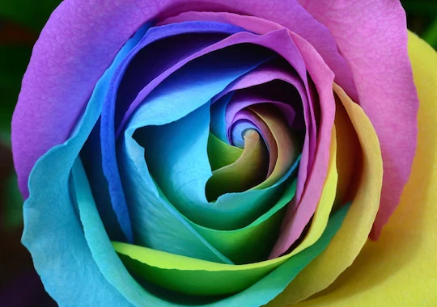
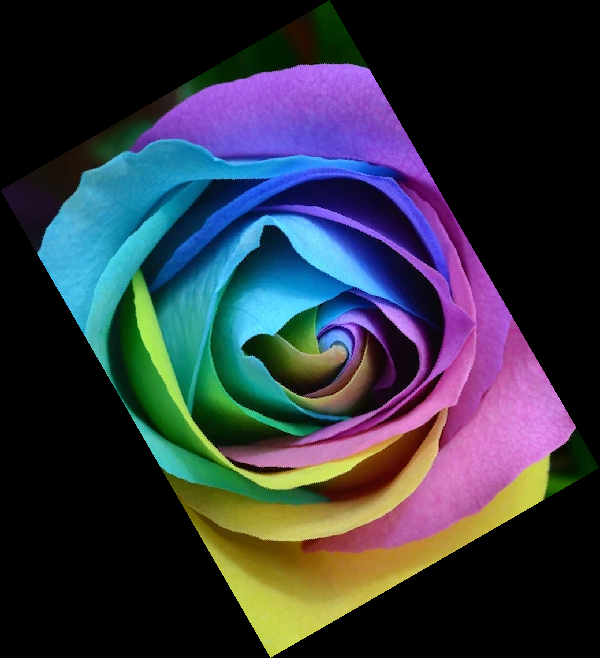
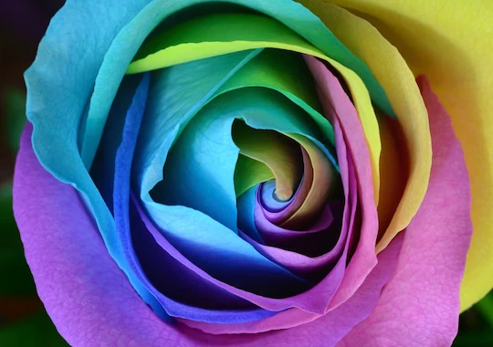
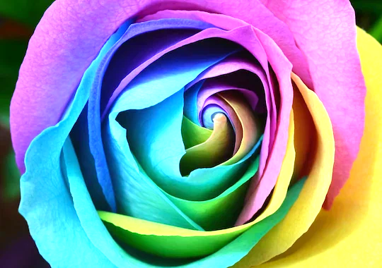

## Server
Pour run le serveur :

```bash
cd server
.\run_server.bat
```

## Utilisation de l'API

### Appeler l'API pour une image en ligne
Pour transformer une image en noir et blanc à partir d'une URL, effectuez une requête POST vers la route `/api/convert-to-bw` avec le champ `image_source` contenant l'URL de l'image.

Exemple de requête :
```bash
curl -X POST -F "image_source=https://example.com/image.jpg" http://127.0.0.1:5000/api/convert-to-bw --output output_image.png
```

### Appeler l'API pour une image locale
Pour transformer une image en noir et blanc à partir d'un fichier local, effectuez une requête POST vers la route `/api/convert-to-bw` avec le champ `image_source` contenant le chemin local de l'image.

Exemple de requête :
```bash
curl -X POST -F "image_source=C:/path/to/local/image.jpg" http://127.0.0.1:5000/api/convert-to-bw --output output_image.png
```

## Routes disponibles

**image d'origine :**



### 1. Transformation en noir et blanc
**Route :** `/api/convert-to-bw`

- **Méthode :** POST
- **Description :** Transforme une image en noir et blanc.
- **Paramètres :**
  - `image_source` : URL ou chemin local de l'image à transformer.

**Exemple d'image après transformation :**


---

### 2. Rotation d'une image
**Route :** `/api/rotate-image`

- **Méthode :** POST
- **Description :** Fait pivoter une image selon un angle donné (en degrés).
- **Paramètres :**
  - `image_source` : URL ou chemin local de l'image à transformer.
  - `angle` : Angle de rotation en degrés (positif pour horaire, négatif pour antihoraire).

**Exemple d'image après transformation :**


---

### 3. Effet miroir sur une image
**Route :** `/api/flip-image`

- **Méthode :** POST
- **Description :** Applique un effet miroir horizontal ou vertical à une image.
- **Paramètres :**
  - `image_source` : URL ou chemin local de l'image à transformer.
  - `direction` : `H` pour un miroir horizontal, `V` pour un miroir vertical.

**Exemple d'image après transformation :**



---

### 4. Floutage d'une image
**Route :** `/api/blur-image`

- **Méthode :** POST
- **Description :** Applique un flou gaussien à une image selon un pourcentage donné.
- **Paramètres :**
  - `image_source` : URL ou chemin local de l'image à transformer.
  - `percent` : Pourcentage de floutage (0-100). Valeur par défaut : 50.

**Exemple d'image après transformation :**


---

### 5. Redimensionnement d'une image
**Route :** `/api/resize-image`

  - `image_source` : URL ou chemin local de l'image à transformer.
  - `x_percent` : Pourcentage de la largeur (par ex. 50 pour 50%).
  - `y_percent` : Pourcentage de la hauteur (par ex. 50 pour 50%).
  - Units: percentages (%) accepted as number or string with '%' suffix (e.g. 80 or '80%').

**Exemple d'appel :**

```bash
curl -X POST -F "image_source=C:/Users/quent/Desktop/github/website/src/img/base.png" -F "x_percent=50" -F "y_percent=120" http://127.0.0.1:5000/api/resize-image --output resized_image.png 
```

**Exemple d'image après transformation :**


---

### 6. Contraste d'une image
**Route :** `/api/contrast-image`

- **Méthode :** POST
- **Description :** Ajuste le contraste d'une image selon un pourcentage.
- **Paramètres :**
  - `image_source` : URL ou chemin local de l'image à transformer.
  - `percent` : Pourcentage de contraste (100 = image originale). Units: percent (%). Accepte nombre ou chaîne avec '%' (ex. 150 ou '150%').

**Exemple d'appel :**

```bash
curl -X POST -F "image_source=src/img/base.png" -F "percent=150" http://127.0.0.1:5000/api/contrast-image --output contrast.png
```

**Exemple d'image après transformation :**


---

### 7. Luminosité d'une image
**Route :** `/api/brightness-image`

- **Méthode :** POST
- **Description :** Ajuste la luminosité d'une image selon un pourcentage.
- **Paramètres :**
  - `image_source` : URL ou chemin local de l'image à transformer.
  - `percent` : Pourcentage de luminosité (100 = image originale). Units: percent (%). Accepte nombre ou chaîne avec '%' (ex. 120 ou '120%').

**Exemple d'appel :**

```bash
curl -X POST -F "image_source=src/img/base.png" -F "percent=120" http://127.0.0.1:5000/api/brightness-image --output brightness.png
```

**Exemple d'image après transformation :**



---

### 8. Rognage d'une image (crop)
**Route :** `/api/crop-image`

- **Méthode :** POST
- **Description :** Rogne l'image depuis les côtés sélectionnés vers le centre. Chaque côté est spécifié par un nombre entier de pixels à enlever.
- **Paramètres (form-data) :**
  - `image_source` : URL ou chemin local de l'image à transformer. (requis)
  - `crop_left` : nombre de pixels à rogner depuis le côté gauche (ex. `10` ou `10px`). Mettre `0` ou omettre pour ne pas rogner.
  - `crop_right` : nombre de pixels à rogner depuis le côté droit.
  - `crop_top` : nombre de pixels à rogner depuis le haut.
  - `crop_bottom` : nombre de pixels à rogner depuis le bas.

**Comportement :**
- Si plusieurs côtés sont sélectionnés, chacun retire la distance donnée vers le centre. Les valeurs sont prises en pixels directement. Si les paramètres conduisent à une image de taille nulle ou négative, la requête échoue avec une erreur.

**Exemple d'appel :**

```bash
curl -X POST \
  -F "image_source=src/img/base.png" \
  -F "crop_left=10" \
  -F "crop_right=0" \
  -F "crop_top=5" \
  -F "crop_bottom=0" \
  http://127.0.0.1:5000/api/crop-image --output cropped_image.png
```

**Exemple d'image après transformation :**


